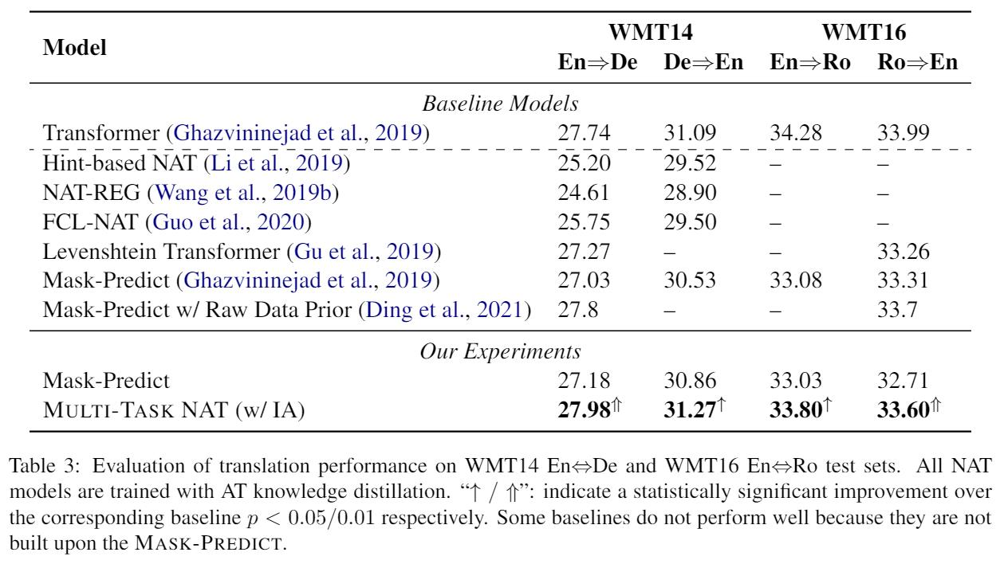
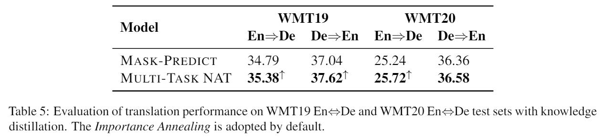

# Multi-Task Learning with Shared Encoder for Non-Autoregressive Machine Translatoin

This repo provides the implementation for [Multi-Task Learning with Shared Encoder for Non-Autoregressive Machine Translatoin](https://arxiv.org/abs/2010.12868) (NAACL 2021)


# Introduction

Non-Autoregressive machine Translation (NAT) models have demonstrated significant inference speedup but suffer from inferior translation accuracy. The common practice to tackle the problem is transferring the Autoregressive machine Translation (AT) knowledge to NAT models, e.g., with knowledge distillation. In this work, we hypothesize and empirically verify that AT and NAT encoders capture different linguistic properties of source sentences. Therefore, we propose to adopt the multi-task learning to transfer the AT knowledge to NAT models through the encoder sharing. Specifically, we take the AT model as an auxiliary task to enhance NAT model performance. Experimental results on WMT14 En-De, WMT16 En-Ro, and WMT19 En-De datasets show that the proposed *Multi-Task NAT* achieves significant improvements over the baseline NAT models. In addition, experimental results demonstrate that our *Multi-Task NAT* is complementary to the standard knowledge transfer method, knowledge distillation.

# Reference Performance

## Main results

We evalute our proposed model on several well established datasets.
The results are as follows


## Large-scale experiments

To further confirm the improvement, we conduct additional large-scale experiments
on WMT19 and WMT20 En-De datasets as shown in the following table



# Reproduction Our Results

## Requirements and Installation

* [PyTorch](http://pytorch.org/) version >= 1.4.0
* Python version >= 3.7

To install from source and develop locally:
```shell
cd multi-task-nat
pip install -e .
```

## Data Preparation
In our paper, we use the standard benchmarks, WMT's En-De and En-Ro data.
You can also replaced this with your private dataset.

To feed the data to the Fairseq models, you need to execute `preprocess.py` first. For more details, please refer to Fairseq's documents.

## Training 
### **Use provided settings**
we have already provided the launch scripts that we have used in our paper,
you can simply run corresponding scripts by
```shell
sh run/train.sh
```
Note that you have to specify those directories left blank in `run/train.sh`

### **Use your customized arguments**
You can set diffrent hyperparameters to fit your demands.

To properely use our model, you must explictly set the following args when executing `train.py`:
```shell
--arch mt_transformer
--task translation_mt
--criterion mt_loss
```

We provide the following extra arguments in this project for you to customize:
* `--share-encoder`
   
  Share encoder's parameters between AT model and NAT model

* `--selection-criterion: str = 'nat'`

  Which loss should be used to decide the best checkpoints

### **Inference**
Before starting to inference, you may need to average several models to get the final model. The script is provided below:

```shell
python scripts/average_checkpoints.py \
  --inputs $CKPT_DIR \
  --output $CKPT_DIR/averaged.pt \
  --num-update-checkpoints 5 \
```
where `$CKPT_DIR` is the checkpoints directory, and `$NUM_UPD` is the number of update steps. 

After obatining the final model, you must explictly set when executing `generate.py`:
```shell
--task translation_mt
```

You can try diffrent settings by modifying the following:
* `--iter-decode-max-iter: int = 10`
  Number of decoding iterates.

* `--iter-decode-length-beam: int = 5`
  Number of predictions of length.

# Citation
If you find this work helpful, please consider citing as follows:
```bibtex
@inproceedings{hao2021multitask,
    title = "Multi-Task Learning with Shared Encoder for Non-Autoregressive Machine Translation",
    author = "Hao, Yongchang  and
      He, Shilin  and
      Jiao, Wenxiang  and
      Tu, Zhaopeng and
      Lyu, Michael and
      Wang, Xing",
    booktitle = "Proceedings of the 2021 Conference of the North American Chapter of the Association for Computational Linguistics: Human Language Technologies",
    year = "2021",
}
```